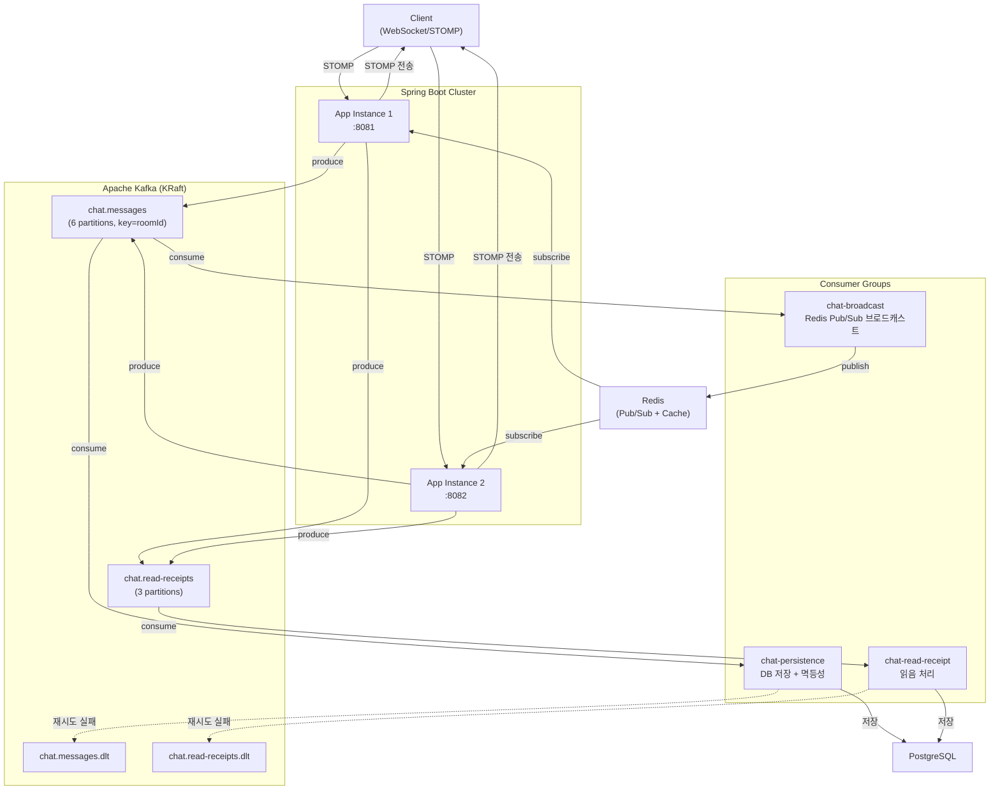
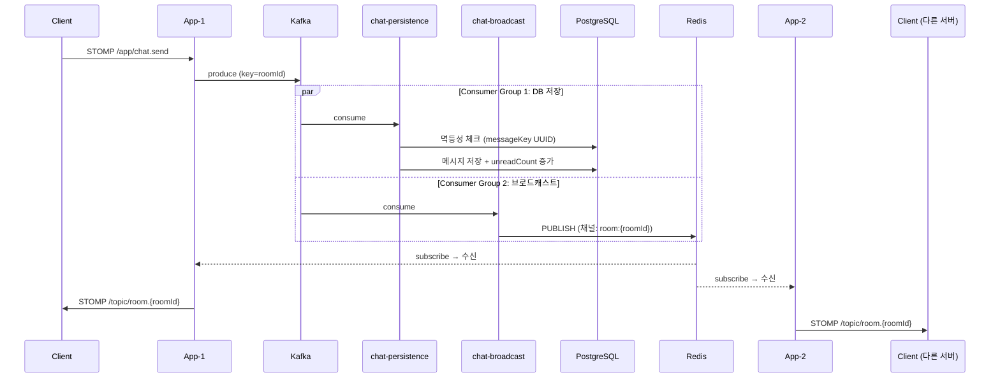
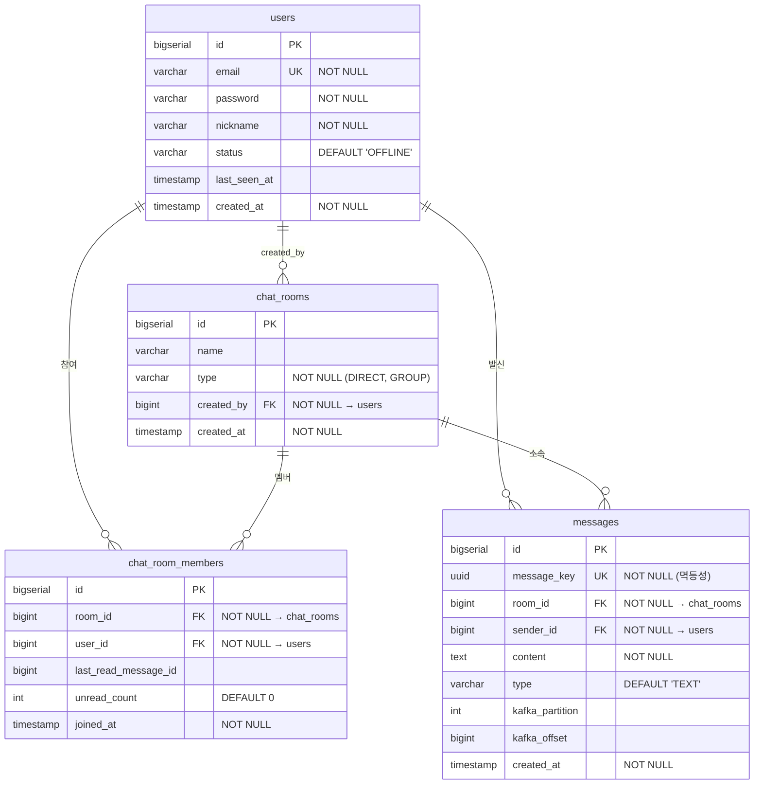

# Realtime Chat

Kafka + WebSocket 기반 실시간 채팅 서비스

> **RPS +70%** | **p50 -69%** | **동시 WebSocket 1,158 세션** — [성능 측정 상세](docs/PERF_RESULT.md)

## 기술 스택

| 영역 | 기술 |
|------|------|
| Runtime | Java 21, Spring Boot 3.4.3 |
| 실시간 통신 | Spring WebSocket (STOMP) |
| 메시지 파이프라인 | Apache Kafka 3.9.0 (KRaft) |
| 세션 공유 + 캐시 | Redis 7 (Pub/Sub + Cache Aside) |
| 저장소 | PostgreSQL 16 |
| 인프라 | Docker Compose (멀티 인스턴스) |
| 테스트 | Testcontainers, k6 |
| 모니터링 | Prometheus, Grafana (Micrometer) |

## 아키텍처



## 메시지 흐름



## ERD



## 성능 최적화 결과

### REST API (200 VU, 50초)

| 메트릭 | Before | After | 개선 |
|--------|--------|-------|------|
| RPS | 937 | 1,598 | **+70.5%** |
| p50 응답시간 | 54.27ms | 16.56ms | **-69.5%** |
| p95 응답시간 | 212.85ms | 149.22ms | **-29.9%** |
| 총 처리량 | 67,417 | 118,900 | **+76.4%** |

- **Before:** N+1 쿼리 (방 10개 → 21회 쿼리) + 캐시 없음
- **After:** JPQL 프로젝션 단일 쿼리 + Redis Cache Aside
- 개선의 주된 원인은 N+1 해결. 캐시 기여분은 제한적 ([상세 분석](docs/PERF_RESULT.md#4-2-rest-api-부하테스트-beforeafter-비교))

### WebSocket (100 VU, 50초)

| 메트릭 | 1대 | 2대 (스케일아웃) |
|--------|-----|-----------------|
| 동시 세션 | 579 | **1,158** |
| 메시지 처리량 | 2,895 | **5,790** |
| STOMP 연결 p95 | 5.52ms | 3.05~3.67ms |
| 연결 실패 | 0% | 0% |

### DB 쿼리 성능 (EXPLAIN ANALYZE)

| 쿼리 | 실행 시간 | 인덱스 |
|------|----------|--------|
| 채팅방 목록 (JPQL 프로젝션) | 0.392ms | idx_chat_room_members_user_id |
| 커서 페이지네이션 | 0.258ms | messages_pkey (역방향 스캔) |
| 멱등성 체크 (messageKey) | 0.439ms | messages_message_key_key (Index Only Scan) |
| unreadCount 계산 | 1.325ms | idx_messages_room_id_id |
| 멤버 존재 여부 | 0.080ms | UK(room_id, user_id) (Index Only Scan) |

## 핵심 기술 챌린지

| 챌린지 | 문제 | 해결 |
|--------|------|------|
| **메시지 순서 보장** | 여러 서버에서 동시 발행 시 순서 깨짐 | Kafka partition key = roomId → 같은 방 메시지는 같은 파티션에서 순서 보장 |
| **WebSocket 스케일아웃** | 서버 간 세션 공유 불가 | Redis Pub/Sub로 크로스 서버 브로드캐스트, Kafka Consumer Group으로 메시지 중복 처리 방지 |
| **Consumer 장애 복구** | Consumer 실패 시 메시지 유실 | manual offset commit + 멱등성(UUID + DB UK) + 3회 재시도 → DLT 격리 |
| **N+1 쿼리** | 채팅방 N개 → 2N+1회 쿼리 | JPQL Constructor Expression으로 단일 쿼리 DTO 프로젝션 |
| **캐시 전략** | 동일 유저 반복 조회 시 DB 부하 | Redis Cache Aside (TTL 5분, 3가지 무효화 전략) |
| **Rate Limiting** | WebSocket 메시지 폭주 | STOMP ChannelInterceptor + ConcurrentHashMap 슬라이딩 윈도우 (10msg/sec) |

## API 엔드포인트

### REST API

| Method | Endpoint | 설명 |
|--------|----------|------|
| POST | `/api/auth/signup` | 회원가입 |
| POST | `/api/auth/login` | 로그인 (JWT 발급) |
| POST | `/api/rooms/direct` | 1:1 채팅방 생성 (중복 방지) |
| POST | `/api/rooms/group` | 그룹 채팅방 생성 |
| POST | `/api/rooms/{roomId}/join` | 그룹 채팅방 참여 |
| GET | `/api/rooms` | 내 채팅방 목록 |
| GET | `/api/rooms/{roomId}` | 채팅방 상세 |
| GET | `/api/rooms/{roomId}/messages?cursor={id}&size={n}` | 메시지 이력 (커서 페이지네이션) |
| POST | `/api/rooms/{roomId}/read` | 읽음 처리 |

### WebSocket (STOMP)

| 타입 | 경로 | 설명 |
|------|------|------|
| 엔드포인트 | `/ws` | WebSocket 연결 (JWT 인증) |
| 전송 | `/app/chat.send` | 메시지 전송 |
| 구독 | `/topic/room.{roomId}` | 채팅방 메시지 수신 |

## 프로젝트 구조

```
src/main/java/com/realtime/chat/
├── config/          # WebSocket, Kafka, Redis, Security 설정
├── controller/      # REST API + WebSocket 메시지 핸들러
├── service/         # 비즈니스 로직 (채팅방, 메시지, 읽음 처리, Presence)
├── consumer/        # Kafka Consumer (DB 저장, 브로드캐스트, 읽음 처리)
├── producer/        # Kafka Producer (메시지, 읽음 이벤트)
├── domain/          # Entity (User, ChatRoom, ChatRoomMember, Message)
├── repository/      # JPA Repository (JPQL 프로젝션, 커서 페이지네이션)
├── dto/             # 요청/응답 DTO
├── event/           # Kafka 메시지 스키마 (ChatMessageEvent, ReadReceiptEvent)
└── common/          # JWT, 예외 처리, 필터
```

## 실행 방법

### 전체 실행 (Docker Compose)

```bash
docker compose up -d
# app-1: localhost:8081, app-2: localhost:8082
```

### 로컬 개발

```bash
# 인프라만 실행
docker compose up -d postgres redis kafka kafka-ui

# 애플리케이션 실행
./gradlew bootRun
```

### 테스트

```bash
# 통합 테스트 (Testcontainers로 PostgreSQL, Kafka, Redis 자동 구동)
./gradlew test
```

### 서비스 포트

| 서비스 | 포트 | URL |
|--------|------|-----|
| App-1 | 8081 | `http://localhost:8081` |
| App-2 | 8082 | `http://localhost:8082` |
| PostgreSQL | 5432 | - |
| Redis | 6379 | - |
| Kafka | 29092 | - |
| Kafka UI | 8090 | `http://localhost:8090` |
| Prometheus | 9090 | `http://localhost:9090` |
| Grafana | 3000 | `http://localhost:3000` (admin/admin) |

## 문서

- [설계 문서](docs/DESIGN.md) — 아키텍처, ERD, Kafka 토픽, 기술 챌린지 상세
- [성능 최적화 기록](docs/PERF_RESULT.md) — N+1 해결, 인덱스, 캐시, k6 Before/After
